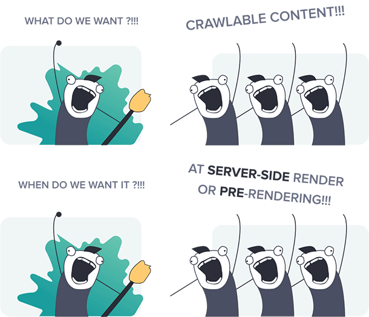

# Single-Page Application in Vue.js

SPA, some applications require rich interactivity, deep session depth, and non-trivial stateful logic on the frontend. The best way to build such applications is to use an architecture where Vue not only controls the entire page, but also handles data updates and navigation without having to reload the page. This type of application is typically referred to as a Single-Page Application (SPA).

In short, a single-page application is an app that doesn’t need to reload the page during its use and works within a browser.



In my case, I have a sample Single-Page Application of Vue.js.

Our goal here is to Dockerise this application, push the Image to Amazon ECR and then deploy it using ECS Fargate attach ELB and ASG.

I have tried using a single-stage Dockerfile but was getting the 404 error when launching a new container because the application was not running in the container because there was nothing that served the vue.js application.

Then, I used a multi-stage Dockerfile which worked fine here is the file

```
FROM node:lts-alpine as build-stage
WORKDIR /app
COPY . .
RUN npm cache clean --force
RUN npm install --legacy-peer-deps
RUN npm run build

FROM nginx:stable-alpine as production-stage
COPY --from=build-stage /app/dist /usr/share/nginx/html
COPY ./nginx/default.conf /etc/nginx/conf.d/default.conf
EXPOSE 80
CMD ["nginx", "-g", "daemon off;"]
```

And, this also reduces the size of the image drastically.

Use the following commands to verify if it's working or not:

```
sudo docker build -t vueimagejs .
```

Now, to run a container:

```
sudo docker container run -d -p 8081:80 vueimagejs
```

Verify by 
```
curl localhost:8081
```

Or just do `localhost:8081` on the browser.

Then Create a repo. in ECR for that configure AWS-CLI.

```
sudo apt install awscli
```

then,

```
aws configure
```
provide the user cred which has ECS access for creating repo. in ECR.

```
aws ecr create-repository --repository-name <repo_name> --region <region_name>
```

Go to the ECR console, Select your Repository and click view push commands.

Go to the ECS console and First make the task definition.

Create new task definition -> Provide Name -> Select AWS Fargate -> OS as Linux
Provide CPUs in my case I choose 1vCPU and Memory as 3GB.
Leave Task role and Task Execution Role as default {if you need to login to your Fargate container you can assign the appropriate Task Execution Role }

Then provide the container details
Name, Image URI from the ECR, port mapping details and CPU, GPU, Memory hard limit, Memory soft limit.

Then You can provide the Environment Variables.

Leave the rest for Default and hit Create.

Go to Clusters:

Provide your Cluster Name.
Select Infrastructure as Fargate.
Then Create.


